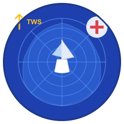

# Polar Doctor ⛵

[](https://github.com/ozolli/polar_doctor/actions)
[](https://opensource.org/licenses/MIT)
[](https://github.com/ozolli/polar_doctor)

**Polar Doctor** est un éditeur et générateur de diagrammes polaires pour voiliers. Il permet de créer, éditer, analyser et exporter des polaires de performance à partir de données NMEA et VDR.



## 🌟 Fonctionnalités

### Génération de polaires
- ✅ Import de fichiers **NMEA** (.txt, .nmea, .log)
- ✅ Import de bases **VDR SQLite** (.db) de qtVlm
- ✅ Sélection multiple de fichiers
- ✅ Agrégation par **percentile configurable** (P85–P95, défaut P90) — vise la performance atteignable
- ✅ Filtrage des données aberrantes
- ✅ **Filtre moteur** automatique (exclut les points moteur via la colonne RPM des VDR, si présente)
- ✅ Mode mise à jour (ne garde que les meilleures performances)

### Édition graphique
- ✅ Tableau de données éditable (double-clic)
- ✅ Ajout/suppression de lignes TWA (angles de vent)
- ✅ Ajout/suppression de colonnes TWS (vitesses de vent)
- ✅ Visualisation polaire en temps réel
- ✅ Interpolation Catmull-Rom pour courbes lisses
- ✅ Sélection de plage TWS pour affichage
- ✅ Couleur distincte par TWS + légende en mode multi-courbes

### Analyse VMG
- ✅ Calcul automatique des meilleurs angles VMG
- ✅ VMG upwind (près) et downwind (portant)
- ✅ Tableau récapitulatif par vitesse de vent
- ✅ **Zones VMG matérialisées sur le diagramme** : vert = plage utile, rouge = près trop serré / portant trop bas

### Mode dynamique (analyse interactive)
- ✅ Courbe **interpolée** pour une TWS quelconque saisie au clavier (ex. 9,85 kn)
- ✅ **Clic maintenu / glissé** sur le diagramme : ligne bleue qui suit le curseur (TWA au degré entier)
- ✅ Lecture en direct **TWA / AWA / AWS / BS / VMG**
- ✅ Au relâchement : vitesse max de la courbe et vitesse max absolue de la polaire

### Export et impression
- ✅ **Export PDF** (données + diagramme + VMG)
- ✅ Nom de fichier automatique (nom de la polaire)
- ✅ Format .pol compatible
- ✅ Mise en page professionnelle
- ✅ Taille de texte ajustable (variable POLAR_PRINT_SCALE)

### Interface multilingue
- 🇫🇷 **Français**
- 🇬🇧 **English**
- ✅ Changement de langue à la volée
- ✅ Traduction complète (interface + aide + export)

## 📦 Installation

### Installation rapide (Linux)

```bash
# Cloner le dépôt
git clone https://github.com/ozolli/polar_doctor.git
cd polar_doctor

# Compiler et installer
make
sudo make install

# Lancer
polar_doctor
```

### Binaires pré-compilés

Téléchargez depuis [GitHub Releases](https://github.com/ozolli/polar_doctor/releases) :
- 🐧 **Linux x86_64** (PC standard)
- 🐧 **Linux ARM64** (Raspberry Pi, serveurs ARM)
- 🍎 **macOS arm64** (Apple Silicon ; Mac Intel : compiler depuis les sources)
- 🪟 **Windows x64** (package portable avec DLLs)

### Compilation depuis les sources

Consultez [BUILD.md](BUILD.md) pour les instructions détaillées pour :
- 🐧 Linux (Debian, Ubuntu, Fedora, Arch)
- 🪟 Windows (MSYS2, MinGW)
- 🍎 macOS (Homebrew)
- 🐳 Docker

## 🚀 Utilisation rapide

### 1. Créer une nouvelle polaire

1. Cliquer sur **"Créer"**
2. Sélectionner un ou plusieurs fichiers NMEA/VDR
3. La polaire est générée automatiquement

### 2. Mettre à jour une polaire existante

1. Ouvrir une polaire (.pol)
2. Cliquer sur **"Mettre à jour"**
3. Sélectionner de nouveaux fichiers de données
4. Seules les performances égales ou meilleures sont conservées

### 3. Éditer manuellement

**Modifier une valeur :**
- Double-cliquer sur une cellule
- Saisir la nouvelle valeur

**Ajouter un angle TWA :**
- Cliquer sur "Ajout TWA"
- Saisir l'angle (0-180°)

**Ajouter une vitesse TWS :**
- Cliquer sur "Ajout TWS"
- Saisir la vitesse en nœuds

**Supprimer ligne/colonne :**
- Cliquer sur "Suppression"
- Cliquer sur l'en-tête à supprimer
- Confirmer

### 4. Visualiser et analyser

**Onglet Polaire :**
- Visualisation graphique du diagramme
- Sélectionner la plage TWS à afficher

**Onglet VMG :**
- Angles optimaux pour le près et le portant
- Tableau récapitulatif par vitesse de vent

### 5. Exporter en PDF

- Cliquer sur **"Export PDF"**
- Choisir l'emplacement de sauvegarde
- Le fichier PDF sera nommé automatiquement d'après la polaire
- **Windows :** Utilise des dialogues natifs Windows pour plus de stabilité
- **Ajuster la taille du texte :** Définir `POLAR_PRINT_SCALE` (0.5 à 3.0, défaut 1.0)
  ```bash
  # Linux/macOS
  export POLAR_PRINT_SCALE=1.5
  ./polar_doctor

  # Windows
  set POLAR_PRINT_SCALE=1.5
  polar_doctor.exe
  ```

## 📊 Format des fichiers

### Fichiers NMEA

Sentences supportées :
- **$IIMWV** - Vent (TWA, TWS)
- **$IIVHW** - Vitesse bateau (STW)

Exemple :
```
$IIMWV,045.2,T,12.3,N,A*XX
$IIVHW,,,,,05.8,N,,*XX
```

### Fichiers VDR (qtVlm)

Base SQLite avec table `VDR` contenant :
- `TWA` - True Wind Angle (°)
- `TWS` - True Wind Speed (kn)
- `STW` - Speed Through Water (kn)

### Fichiers polaires (.pol)

Format CSV avec point-virgule :
```
TWA\TWS;6;8;10;12;14
30;4.2;5.1;5.8;6.2;6.5
45;4.8;5.9;6.7;7.1;7.4
60;5.2;6.4;7.3;7.8;8.1
...
```

## 🎨 Raccourcis clavier

| Raccourci | Action |
|-----------|--------|
| `Ctrl+O` | Ouvrir |
| `Ctrl+S` | Enregistrer |
| `Ctrl+N` | Créer nouvelle polaire |
| `F1` | Aide |
| `Ctrl+Q` | Quitter |

## 🛠️ Compilation

### Prérequis

- GCC ou Clang
- GTK+ 3.0+
- SQLite3
- pkg-config

### Commande simple

```bash
gcc -o polar_doctor polar_doctor.c \
    `pkg-config --cflags --libs gtk+-3.0` \
    -lm -lsqlite3
```

### Avec le Makefile

```bash
make              # Compiler
make clean        # Nettoyer
make install      # Installer (Linux/macOS)
make dist         # Créer un package
make help         # Aide
```

## 📚 Documentation

- **[BUILD.md](BUILD.md)** - Guide de compilation multi-plateformes
- **[CLAUDE.md](CLAUDE.md)** - Documentation technique du projet
- **Aide intégrée** - Appuyez sur le bouton "Aide" dans l'application

## 🔧 Architecture

```
polar_doctor.c           # Code source principal (130+ KB)
├── Structures de données
│   ├── PolarData       # Grille polaire
│   ├── polar_grid_t    # Buckets de mesures
│   └── AppWidgets      # Interface GTK
├── Moteur de calcul
│   ├── NMEA parser     # Lecture sentences
│   ├── VDR reader      # Lecture SQLite (+ filtre RPM)
│   ├── Agrégation      # Percentile (P90)
│   └── VMG calculator  # Angles optimaux
├── Interface GTK
│   ├── Éditeur tableau
│   ├── Diagramme polaire
│   ├── Tableau VMG
│   └── Export PDF
└── I18N
    ├── Français
    └── English
```

## 🧪 Tests

Fichiers de test inclus :
- `Horta-SantaCruz.db` - Passage Açores → Canaries
- `Mindelo-LeMarin.db` - Traversée Cap-Vert → Martinique
- Autres bases VDR de passages océaniques

## 🐛 Signalement de bugs

Ouvrir une issue sur GitHub avec :
- Système d'exploitation et version
- Étapes pour reproduire
- Messages d'erreur
- Fichiers de test si possible

## 🤝 Contribution

Les contributions sont bienvenues !

1. Fork le projet
2. Créer une branche (`git checkout -b feature/nouvelle-fonctionnalite`)
3. Commit (`git commit -am 'Ajout nouvelle fonctionnalité'`)
4. Push (`git push origin feature/nouvelle-fonctionnalite`)
5. Créer une Pull Request

## 📄 Licence

Ce projet est sous licence MIT. Voir le fichier LICENSE pour plus de détails.

## 👨‍💻 Auteur

Développé avec ❤️ pour la communauté nautique

## 🙏 Remerciements

- **GTK Project** - Toolkit graphique
- **SQLite** - Base de données
- **qtVlm** - Format VDR
- Tous les navigateurs qui ont contribué des données de test

## 📈 Statistiques

- **Lignes de code :** ~4100
- **Fonctions :** 90+
- **Formats supportés :** 3 (NMEA, VDR, POL)
- **Langues :** 2 (FR, EN)
- **Plateformes :** Linux, Windows, macOS

---

**Bon vent ! ⛵**
