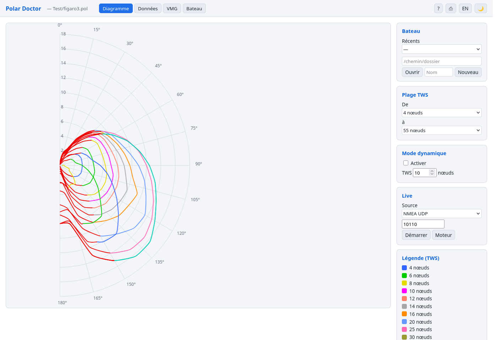

# Polar Doctor ⛵

[](https://github.com/ozolli/polar_doctor/actions)
[](https://opensource.org/licenses/MIT)
[](https://github.com/ozolli/polar_doctor)

**Polar Doctor** fabrique, édite et analyse les polaires de performance d'un voilier à
partir de vos **données de navigation réelles** (logs NMEA0183, bases VDR de qtVlm, ou
capture en direct).

Depuis la version 2.0, c'est une **application web** : un petit serveur (`polar_doctor_web`)
tourne sur l'ordinateur de bord, et s'utilise depuis **n'importe quel navigateur** — à la
table à carte, sur un portable, une tablette ou un téléphone au cockpit. Aucun logiciel à
installer sur les appareils clients.



## ⚓ C'est quoi une polaire (et à quoi sert ce programme) ?

La **polaire** d'un voilier est un tableau — et un diagramme — qui donne la vitesse
du bateau pour chaque combinaison d'**angle** et de **force** du vent. C'est la carte
d'identité de performance du bateau, utilisée par les logiciels de routage et pour
comparer/régler vos navigations.

Polar Doctor fabrique cette polaire à partir de vos données **réelles** : fichiers de
log NMEA0183, bases VDR de qtVlm, ou **en direct** pendant que vous naviguez. Plus vous
accumulez de données dans des conditions variées, plus la polaire est fidèle.

**Le vocabulaire en 30 secondes :**

| Sigle | Signification |
|-------|---------------|
| **TWA** | *True Wind Angle* — angle du vent réel par rapport à l'axe du bateau, de 0° (vent debout) à 180° (vent arrière) |
| **TWS** | *True Wind Speed* — force du vent réel (nœuds) |
| **STW / BSP** | *Speed Through Water* — vitesse du bateau dans l'eau (loch) ; c'est ce que la polaire représente |
| **SOG** | *Speed Over Ground* — vitesse par rapport au fond (GPS) ; sert à fiabiliser le STW |
| **VMG** | *Velocity Made Good* — composante de la vitesse dans l'axe du vent ; efficacité au près et au portant |
| **AWA / AWS** | vent **apparent** ressenti à bord (vent réel combiné à la vitesse du bateau) |

**Prise en main en 4 étapes :** ① ouvrir ou créer un bateau (carte *Bateau*) → ② régler
son inventaire et ses polaires (onglet *Bateau*) → ③ **Créer** une polaire depuis des
fichiers de log (onglet *Données*) ou **capturer en direct** (carte *Live*) → ④ lire
(*Diagramme*, *VMG*), corriger (*Données*), imprimer en PDF.

## 🌟 Fonctionnalités

### Construire une polaire
- ✅ Import de logs **NMEA0183** (.nmea, .log, .txt) et de bases **VDR SQLite** (.db) de qtVlm
- ✅ **Créer** une polaire neuve, ou **Mettre à jour** une polaire existante : l'existant et les
  nouvelles données sont ré-agrégés, la polaire peut monter **ou** baisser (utile pour ramener
  une polaire théorique VPP à la réalité du bateau)
- ✅ Agrégation par **percentile** (P85–P95, défaut P90) sur des cases de 5° × 2 nœuds, minimum
  3 points par case : on vise la performance *atteignable*, pas la moyenne
- ✅ **Lissage glissant** du STW (anti-bruit du loch) et **débruitage par le SOG** (les sauts du
  loch sont rejetés, un courant lent est préservé)
- ✅ **Filtre moteur** : points moteur exclus (RPM > 0 dans le VDR), sauf charge batteries
  (mot-clé `Charge` dans le commentaire)
- ✅ **Vent vrai rapporté à l'eau** (`MWV,T`) prioritaire ; `MWD` + cap en repli

### Le bateau
- ✅ Un **bateau = un dossier** (`boat.cfg` + ses polaires `.pol`) ; bateaux **récents**,
  ouverture et création à chaud
- ✅ **Inventaire** : états de grand-voile, voiles d'avant, états de mer (échelle **Douglas**),
  mots-clés moteur
- ✅ **Polaires multiples** : chaque polaire a ses critères (voiles × états de mer) en cases à
  cocher ; un critère absent de l'inventaire est signalé

### Capture live
- ✅ Sources **NMEA UDP**, **NMEA TCP** ou **VDR qtVlm** (suivi de `vdr.db`) — le **NMEA2000**
  s'utilise via une passerelle qui le traduit en 0183 (n2k-mux, kplex, Actisense NGX-1…)
- ✅ **État du bateau en direct** (grand-voile, voile d'avant, mer) : chaque point est routé vers
  **toutes** les polaires dont les critères correspondent ; bouton **Moteur**
- ✅ Nuage de points, point courant et **polaire qui se construit en direct**
- ✅ À l'arrêt, chaque polaire alimentée est **enregistrée**

### Lire et corriger
- ✅ **Diagramme** : courbes lissées (Catmull-Rom), une couleur par TWS, **zones VMG** (plage utile
  / VMG dégradé en rouge), plage de TWS réglable
- ✅ **Mode dynamique** : courbe interpolée pour une TWS quelconque, lecture TWA / AWA / AWS / BS /
  VMG au survol
- ✅ **Données** : tableau éditable, ajout/suppression de TWA et de TWS
- ✅ **VMG** : meilleurs angles au près et au portant par TWS
- ✅ **Export PDF** par l'impression du navigateur
- ✅ Français / anglais, thème clair / sombre, **aide intégrée**

## 📦 Installation

### Binaires pré-compilés

Sur la page [Releases](https://github.com/ozolli/polar_doctor/releases) :
- 🐧 **Linux x86_64** et **Linux ARM64** (Raspberry Pi)
- 🪟 **Windows x64** (exécutable + DLL, rien à installer)

### Depuis les sources (Linux)

```bash
sudo apt install build-essential pkg-config libglib2.0-dev libsqlite3-dev
git clone https://github.com/ozolli/polar_doctor.git && cd polar_doctor
make
./polar_doctor_web ~/MonBateau          # puis http://localhost:8081
```

Windows (MSYS2) et autres distributions : voir **[BUILD.md](BUILD.md)**.

### En service (démarrage automatique, accès depuis le réseau)

```bash
make                                      # en utilisateur normal
sudo make install                         # binaire + service systemd pour cet utilisateur
sudo nano /etc/default/polar_doctor_web   # WEB_AUTH=utilisateur:motdepasse
sudo systemctl enable --now polar_doctor_web
```

Puis `http://<ordinateur-de-bord>:8081` depuis n'importe quel appareil du réseau. Le service
rouvre automatiquement le dernier bateau utilisé.

## 🚀 Lancer à la main

```
polar_doctor_web [dossier-bateau | fichier.pol] [--port N] [--bind ADDR] [--config FICHIER] [--allow-anonymous]
```

| Option | Rôle |
|--------|------|
| *dossier-bateau* | bateau ouvert au démarrage (sinon `POLAR_DOCTOR_BOAT`, sinon le plus récent) |
| `--port N` | port d'écoute (défaut **8081**) |
| `--bind ADDR` | adresse d'écoute (défaut `127.0.0.1` ; `0.0.0.0` = accessible depuis le réseau) |
| `--config FICHIER` | fichier de réglages (défaut `web.conf`, voir [Où mettre le mot de passe ?](#où-mettre-le-mot-de-passe-)) |
| `--allow-anonymous` | autorise l'écoute réseau **sans** mot de passe (déconseillé) |

## 🔐 Accès et sécurité

L'interface **écrit** des fichiers (polaires, `boat.cfg`), crée des dossiers et lit des fichiers
du serveur. Donc :
- en local (`127.0.0.1`, le défaut), pas de mot de passe ;
- sur le réseau (`--bind 0.0.0.0`), **mot de passe obligatoire** : le serveur refuse de démarrer
  sans lui (sauf `--allow-anonymous`) ;
- connexion par **page web** (pas de popup) : un cookie `HttpOnly`, `SameSite=Strict`, valable
  1 an par appareil. Changer le mot de passe déconnecte tous les appareils ;
- `curl -u utilisateur:motdepasse` reste accepté pour les scripts.

### Où mettre le mot de passe ?

Toujours sous la forme `WEB_AUTH=utilisateur:motdepasse`, **jamais sur la ligne de commande**.

**Windows** — dans le fichier **`%LOCALAPPDATA%\polar_doctor\web.conf`**. Au premier lancement,
le serveur le crée, tout commenté, et affiche son chemin. Pour l'ouvrir : touche Windows + R,
`notepad %LOCALAPPDATA%\polar_doctor\web.conf`, puis enlever le `#` des lignes utiles :

```ini
WEB_AUTH=moi:MonMotDePasse
BIND=0.0.0.0
```

Relancer `polar_doctor_web.exe` : il écoute sur le réseau avec ce mot de passe. Le dossier
`%LOCALAPPDATA%` n'est accessible qu'à votre compte (et aux administrateurs). Au premier lancement réseau, le
pare-feu Windows demande d'autoriser le programme.

**Linux, en service systemd** — dans **`/etc/default/polar_doctor_web`** (créé par
`sudo make install`, ou copié depuis `polar_doctor_web.default` de l'archive), lisible par root
seul. Le service écoute déjà sur le réseau :

```bash
sudo nano /etc/default/polar_doctor_web     # WEB_AUTH=moi:MonMotDePasse
sudo systemctl restart polar_doctor_web
```

**Linux, lancé à la main** — dans **`~/.config/polar_doctor/web.conf`** (même format que sous
Windows, à créer, `chmod 600` exigé : le serveur refuse un fichier lisible par d'autres).

Autres possibilités, sur les deux systèmes : `--config FICHIER` pour un autre emplacement, ou la
variable d'environnement `WEB_AUTH`. En cas de réglages multiples, l'ordre de priorité est
**ligne de commande > variable d'environnement > `web.conf`**.

| Clé de `web.conf` | Rôle | Défaut |
|-------------------|------|--------|
| `WEB_AUTH` | `utilisateur:motdepasse` (obligatoire hors `127.0.0.1`) | — |
| `BIND` | adresse d'écoute (`0.0.0.0` = réseau) | `127.0.0.1` |
| `PORT` | port d'écoute | `8081` |
| `POLAR_DOCTOR_BOAT` | bateau ouvert au démarrage | le plus récent |

## 📊 Format des fichiers

### Fichiers NMEA

| Phrase | Rôle |
|--------|------|
| **MWV** (réf. `T`) | vent vrai, rapporté à l'eau — *prioritaire*. Le vent **apparent** (réf. `R`) est ignoré |
| **MWD** + **HDT / HDG** | vent vrai rapporté au fond + cap : TWA = TWD − cap (repli si pas de `MWV,T`) |
| **VHW** | vitesse surface (STW) — *requise* |
| **RMC, VTG, VBW, RMA, OSD** | vitesse fond (SOG), lue si présente pour débruiter le STW |

Les angles `MWV` (0–360° depuis l'étrave) sont repliés sur 0–180° : les deux bords comptent.
Unités de vent reconnues : **nœuds (`N`)**, **m/s (`M`)**, **km/h (`K`)**.

```
$IIMWV,315.0,T,12.3,N,A*XX        vent vrai 45° bâbord, 12,3 nœuds
$IIVHW,,T,,M,5.8,N,,K*XX          STW 5,8 nœuds
$GPRMC,123519,A,4807.038,N,01131.000,E,5.9,084.4,230394,,,A*XX
```

### Fichiers VDR (qtVlm)

Base SQLite, table `VDR` : `TWA`, `TWS`, `STW` ; optionnellement `SOG` (débruitage), `RPM` (filtre
moteur) et `COMMENT` (mot-clé `Charge` = moteur débrayé, données conservées).

### Fichiers polaires (.pol)

Tableau à point-virgule. La première colonne après `TWA\TWS` est une **colonne sentinelle TWS 0**
(toujours présente, jamais affichée) :

```
TWA\TWS;0;6;8;10;12
45;0.00;4.80;5.90;6.70;7.10
60;0.00;5.20;6.40;7.30;7.80
90;0.00;5.60;6.90;7.80;8.40
```

## 🔧 Architecture

```
libpolar.h / libpolar.c   cœur métier : types, constantes, globals (glib + sqlite, sans UI)
import.c                  NMEA / VDR, lissage, débruitage STW/SOG, filtre moteur, agrégation
polar_data.c              modèle de polaire : .pol, interpolation, VMG
boat_config.c             bateau : inventaire, polaires, boat.cfg (INI), bateaux récents
web/server.c              serveur HTTP (mono-processus, boucle poll()), API JSON, interface
                          embarquée (HTML/JS/Canvas), capture live, authentification
web/polar_doctor_web.*    service systemd et réglages (/etc/default)
```

Aucune dépendance graphique : **glib** et **sqlite3** seulement.

## 🧪 Données de test

Le dossier `Test/` contient des bases VDR de traversées (`Horta-SantaCruz.db`,
`Mindelo-LeMarin.db`…), `Comments.db` (colonnes `COMMENT`/`RPM`) et un log NMEA réel
(`Hakefjord.nmea`).

## 🐛 Signalement de bugs

Ouvrir une issue sur GitHub avec le système, les étapes pour reproduire, les messages
d'erreur et, si possible, un fichier de données.

## 📄 Licence

MIT — voir le fichier [LICENSE](LICENSE).

## 🙏 Remerciements

- **GLib** et **SQLite**
- **qtVlm** — format VDR
- Tous les navigateurs qui ont contribué des données de test

---

**Bon vent ! ⛵**
